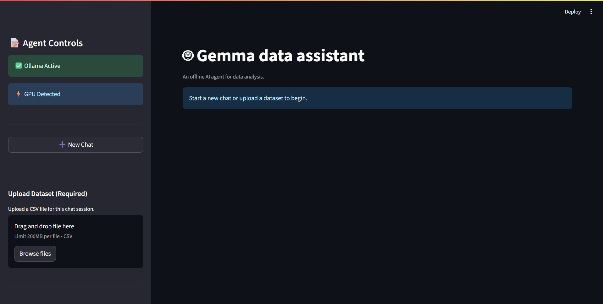

Of course, here is the enhanced version of your markdown code, incorporating the admonition blocks for better readability and emphasis.

# 🛠 Installation & Setup Instructions

*Professional Setup Guide for Gemma Data Assistant on Windows*

This comprehensive guide will walk you through setting up the Gemma Data Assistant on your Windows system. Please follow each step carefully to ensure optimal performance and functionality.

---

## 📋 *Prerequisites & System Requirements*

> [!IMPORTANT]
> Before proceeding with the installation, ensure your Windows system meets the following requirements. Failing to meet these minimums may result in poor performance or installation failure.

### *User Responsibilities:*
- *Operating System*: Windows 10/11 (64-bit)
- *RAM*: Minimum 8GB, 16GB recommended
- *Storage*: At least 10GB free space
- *Internet*: Required for initial setup and model downloads

---

## ⚡ *Step 1: GPU Acceleration Setup (Recommended)*

### *NVIDIA GPU Users:*
If you have a modern NVIDIA GPU, installing CUDA Toolkit will significantly improve performance:

1. *Check GPU Compatibility*: Ensure you have a CUDA-capable NVIDIA GPU
2. *Download CUDA Toolkit*: Visit [NVIDIA CUDA Downloads](https://developer.nvidia.com/cuda-downloads)
3. *Install CUDA*: Follow the installation wizard with default settings
4. *Verify Installation*: Open Command Prompt and run `nvcc --version or nvidia-smi`

> [!TIP]
> CUDA installation is optional but highly recommended for faster AI model inference. Users without a compatible GPU can proceed to the next step, but should expect longer processing times.

---

## 🐍 *Step 2: Python Installation*

### *Install Python 3.11.0 (Recommended Version):*

1. *Download Python*: Go to [python.org](https://www.python.org/downloads/release/python-3110/)
2. *Run Installer*: Download the Windows installer (64-bit)
3. *Installation Options*:
   > [!IMPORTANT]
   > On the first screen of the installer, you **must** check the box for **"Add Python to PATH"**. This is crucial for the system to find the `python` and `pip` commands.
   - ✅ Check "Add Python to PATH"
   - ✅ Check "Install for all users"
   - Choose "Customize installation" for advanced options
4. *Verify Installation*: Open Command Prompt and run:
   ```shell
   python --version
   pip --version
   ```

---

## 🤖 *Step 3: Ollama Installation & Model Setup*

### *Install Ollama:*
1. *Download Ollama*: Visit the official download link: [https://ollama.com/download/OllamaSetup.exe](https://ollama.com/download/OllamaSetup.exe)
2. *Run Installation*: Execute the downloaded file and follow the setup wizard
3. *Complete Installation*: Restart your computer if prompted

### *Download Required AI Models:*
Open *Command Prompt* or *PowerShell* as Administrator and run these commands one by one:
```shell
ollama pull gemma3n:e2b && ollama pull nomic-embed-text:v1.5
```

### *Verify Model Installation:*
Check if models are properly installed by running: `ollama list`
```shell
ollama list
```

> [!NOTE]
> The output should look similar to this. The exact ID and size may vary.
>
> ```
> NAME                   ID           SIZE    MODIFIED
> gemma3n:e2b            ...          5.6 GB  ...
> nomic-embed-text:v1.5   ...          274 MB  ...
> ```

### *Start Ollama Service:*
Keep Ollama running in the background:
```shell
ollama serve
```
> [!TIP]
> Keep this terminal window open and running in the background for optimal performance. You can minimize it, but do not close it while using the Gemma Data Assistant.

---

## 📥 *Step 4: Download Gemma Data Assistant*

> [!TIP]
> Using `git clone` is the recommended method as it makes future updates much easier to manage.

### *Method 1: Git Clone (Recommended)*
Open a new Command Prompt or PowerShell window and run:
```shell
git clone https://github.com/MarvelBoy047/Gemma_Ai_DataAssistant.git
```
### *Method 2: Direct Download*
1. Visit: [https://github.com/MarvelBoy047/Gemma_Ai_DataAssistant](https://github.com/MarvelBoy047/Gemma_Ai_DataAssistant)
2. Click *"Code"* → *"Download ZIP"*
3. Extract the ZIP file to your desired location

---

## 🔧 *Step 5: Install Dependencies*

Navigate to the project directory and install required packages:
```shell
cd Gemma_Ai_DataAssistant && pip install -r requirements.txt
```
> [!NOTE]
> This process may take 5-10 minutes depending on your internet speed and system performance. Please be patient.

---

## 🚀 *Step 6: Launch the Application*

### *Start the Application:*
In the project directory, run:
```shell
streamlit run app.py
```

### *Initial Setup Process:*


> [!NOTE]
> **First-Time Launch:** The application will index the knowledge base, which is a one-time process that takes 2-3 minutes. Subsequent launches will be much faster (10-15 seconds).

### *Access the Application:*
- Your default browser will automatically open to http://localhost:8501
- The application interface will be ready for use

---

## 📺 *Step 7: Usage Instructions & Tutorial*

For comprehensive usage instructions and tutorials, watch our detailed video guide:

[](https://www.youtube.com/watch?v=dQw4w9WgXcQ)

*Watch the complete tutorial:* [Gemma Data Assistant - Complete Setup & Usage Guide](https://www.youtube.com/watch?v=dQw4w9WgXcQ)

---

## ✅ *System Compatibility & Testing*

### *Tested Configurations:*
- ✅ *NVIDIA RTX 2060*: Excellent performance, fast response times
- ✅ *AMD CPU-only*: Fair performance, longer processing times but fully functional
- ✅ *Windows 10/11*: Fully supported and tested

### *Compatibility Notes:*
> [!CAUTION]
> The application has not been tested on macOS or Linux. While it may run, unexpected behavior or errors could occur. If using on an untested system, monitor performance carefully.

---

## ⚠ *Known Limitations & Troubleshooting*

### *Disk Space Management:*
If you experience disk space issues after extended use, you can clear temporary files.

> [!CAUTION]
> **NEVER DELETE THE `knowledge_base.json` FILE.** This file is the "brain" of the Gemma assistant and deleting it will require a full re-setup. Only delete the contents of `agent_memory/` and `chat_history/` if absolutely necessary.

### *Performance Considerations:*
- *Task Size Impact*: Smaller analysis requests result in faster responses.
- *Memory Usage*: Analyzing large datasets may require more than the minimum 8GB of RAM.
- *Concurrent Sessions*: Only one analysis per chat session is supported (future updates will address this).

### *Common Issues:*
> [!WARNING]
> If you encounter frequent errors or slow performance, follow these troubleshooting steps before seeking support.
>
> - **Slow Response**: Ensure CUDA is properly installed and that `ollama serve` is running.
> - **Memory Errors**: Close other resource-heavy applications (like web browsers with many tabs) to free up RAM.
- **Port Conflicts**: If port 8501 is busy, Streamlit will suggest an alternative.
- **Model Loading Issues**: Restart the `ollama serve` terminal if models fail to load.

---

## 🔄 *Future Updates & Patches*

### *Planned Improvements:*
- *Multiple Analyses*: Support for multiple notebooks per chat session
- *Cross-Platform*: macOS and Linux compatibility
- *Performance*: Enhanced memory management and speed optimizations
- *Features*: Additional analysis templates and visualization options

> [!NOTE]
> Regular patches will be released via our GitHub repository. To get the latest updates, run `git pull` in the project directory.

---

## 📞 *Support & Assistance*

### *If You Encounter Issues:*
1. *Check System Requirements*: Ensure all prerequisites are met.
2. *Restart Services*: Try restarting the `ollama serve` terminal and the application.
3. *Review Logs*: Check the terminal output for specific error messages.
4. *GitHub Issues*: Report bugs at our repository.
5. *Community Support*: Join our Discord server for help.

> [!TIP]
> For the best experience, follow these performance tips:
> - Close unnecessary applications to free up system resources.
> - Use an SSD for your operating system and the project folder.
> - Ensure your system has adequate cooling and doesn't overheat during intensive tasks.

---

*🎉 Congratulations! You're now ready to harness the power of AI-driven data analysis with complete privacy and professional-grade results.*
